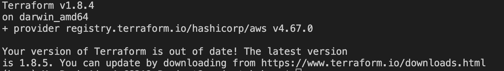
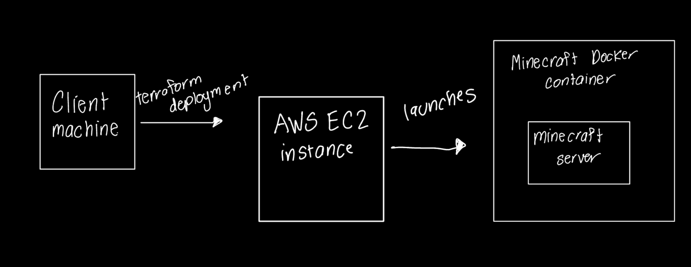

# CS312-Project2

## Background

This project will demonstrate how to connect and run the Minecraft server on AWS using Terraform. The Terraform script will create an EC2 Instance on Amazon Linux 2 in the Oregon region and will set up a Docker image to host the server.

## Configuration and Tools

To run the pipeline, you will need the following: 
    - AWS account and credentials 
    - Terraform installation 
        - To check if terraform is installed, you can run the command: terraform version

        

## Major Steps Diagram

## Commands to Run the Server

    - touch ~/.aws/credentials
    The credentials can be obtained through the AWS Academy Learner's Lab under 'AWS Details'. 
    Insert the AWS CLI credentials into the file and save.

    - terraform init 
    This will initialize the terraform working directory.

    - terraform apply 
    This command will apply the commands and instructions in the terraform script. This includes connecting to the AWS instance and starting the Docker container.

    When the terraform apply command is running prompts to enter the path to your public and private keys will appear. 

    Once the public and private key paths have been entered, type yes to start the server

    - In another terminal instance, enter the nmap command below in the next section:

## Command to connect to Minecraft Server
nmap -sV -Pn -p T:25565 <public IP address>

This command should result in a table that verifies that the Minecraft server is running.

